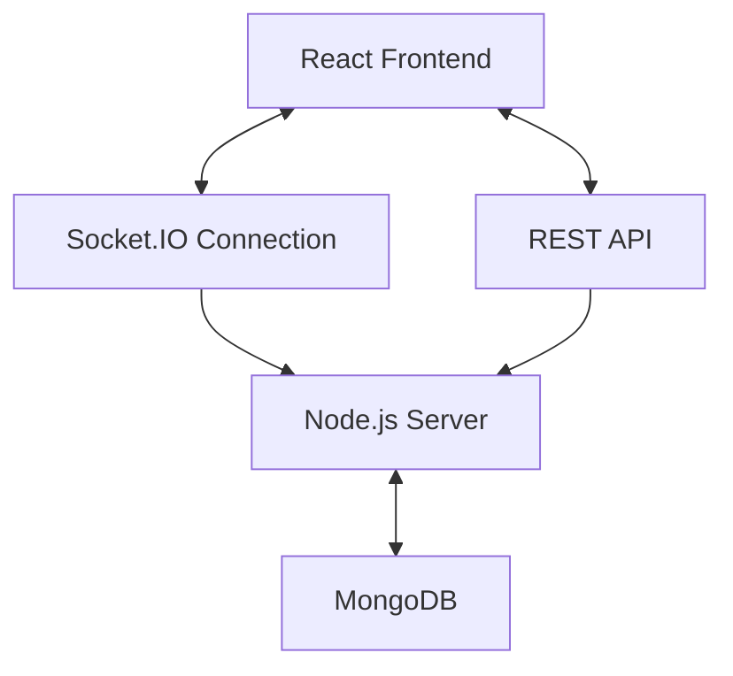

# Chat Application Architecture Documentation

## Overview

This document outlines the architecture of the Chat Application, which is built using React for the frontend and Node.js with Socket.IO for the backend. The application provides real-time messaging with features like offline support, message reactions, threading, and user authentication.

## System Architecture

The application uses a client-server architecture:

- **Frontend**: React with functional components and hooks
- **Backend**: Node.js with Express and Socket.IO
- **Database**: MongoDB with Mongoose ODM



## Key Design Patterns

1. **Context API Pattern**: For state management (AuthContext, ChatContext, ThemeContext)
2. **Reducer Pattern**: For complex state changes with domain-specific reducers
3. **Optimistic Updates**: Immediate UI updates with offline support
4. **Memoization Pattern**: Performance optimization with React.memo and useMemo
5. **Component Composition**: Breaking down complex components into smaller, focused ones
6. **Proxy/Middleware Pattern**: For authentication and validation
7. **Observer Pattern**: For real-time updates via Socket.IO

## Code Organization

### Frontend Structure

```
chat/src/
├── components/         # UI components
│   ├── auth/           # Authentication components
│   ├── chat/           # Chat-related components
│   └── common/         # Shared components
├── context/            # React contexts
├── services/           # Service classes
└── utils/              # Helper functions
```

### Backend Structure

```
server/
├── config/             # Configuration files
├── controllers/        # Request handlers
├── middleware/         # Express middleware
├── models/             # Mongoose models
└── routes/             # API routes
```

## Key Improvements Made

### 1. Refactored Controller Functions

The `messageController.js` file has been refactored to extract common utilities:

- Validation functions
- Entity retrieval functions
- Error handling functions
- Status update functions

### 2. Modularized Context Management

The `ChatContext.jsx` file has been improved:

- Split into domain-specific reducers (connection, messages, users, notifications, UI)
- Extracted common utility functions
- Improved error handling and offline support

### 3. Component Refactoring

UI components have been refactored following atomic design principles:

- `ChatInput.jsx`: Broken down into smaller components (InputError, MessageInputField, EmojiPickerControl, SendButton)
- `MessageItem.jsx`: Decomposed into specialized components (UserAvatar, MessageTimestamp, MessageHeader, ReplyIndicator, MessageContent, MessageBubble)

## Roadmap for Future Development

### 1. Enhance Error Handling System (Priority: High)

- Create a consistent error handling strategy
- Implement structured error types
- Improve error reporting to users
- Estimated time: 3 days

### 2. Improve Offline Support (Priority: High)

- Enhance message queue mechanism
- Add better conflict resolution for offline edits
- Implement data synchronization when coming back online
- Estimated time: 4 days

### 3. Optimize Performance (Priority: Medium)

- Implement virtualization for message lists
- Optimize database queries
- Add pagination for long conversations
- Estimated time: 3 days

### 4. Enhance Security (Priority: High)

- Implement CSRF protection
- Add rate limiting to prevent abuse
- Audit and fix security vulnerabilities
- Estimated time: 2 days

### 5. Improve Accessibility (Priority: Medium)

- Ensure all components meet WCAG guidelines
- Add keyboard navigation
- Improve screen reader support
- Estimated time: 3 days

### 6. Implement Design System (Priority: Medium)

- Extract UI components into a reusable library
- Standardize colors, spacing, and typography
- Create documentation for UI components
- Estimated time: 5 days

### 7. Add User Features (Priority: Low)

- User profile management
- User settings and preferences
- User status indicators
- Estimated time: 4 days

### 8. Enhance Messaging Features (Priority: Medium)

- Add file attachments
- Add message formatting options
- Add read receipts
- Estimated time: 5 days

### 9. Improve Testing Coverage (Priority: High)

- Expand unit tests for critical components
- Add integration tests for user flows
- Implement end-to-end testing
- Estimated time: 4 days

### 10. Documentation (Priority: Medium)

- Create API documentation with JSDoc
- Update README with setup and configuration
- Add user guide with examples
- Estimated time: 3 days

## Implementation Notes

### Coding Standards

- Follow SOLID principles
- Use DRY (Don't Repeat Yourself) approach
- Implement KISS (Keep It Simple, Stupid) methodology
- Use meaningful variable and function names
- Add JSDoc comments for all functions and components

### Maintenance Strategy

- Regular code reviews
- Continuous integration with automated tests
- Periodic dependency updates
- Performance monitoring
- User feedback collection

## Conclusion

This architecture document provides a comprehensive overview of the current system structure and a clear roadmap for future development. By following these guidelines, the chat application can evolve into a more robust, maintainable, and feature-rich platform.
