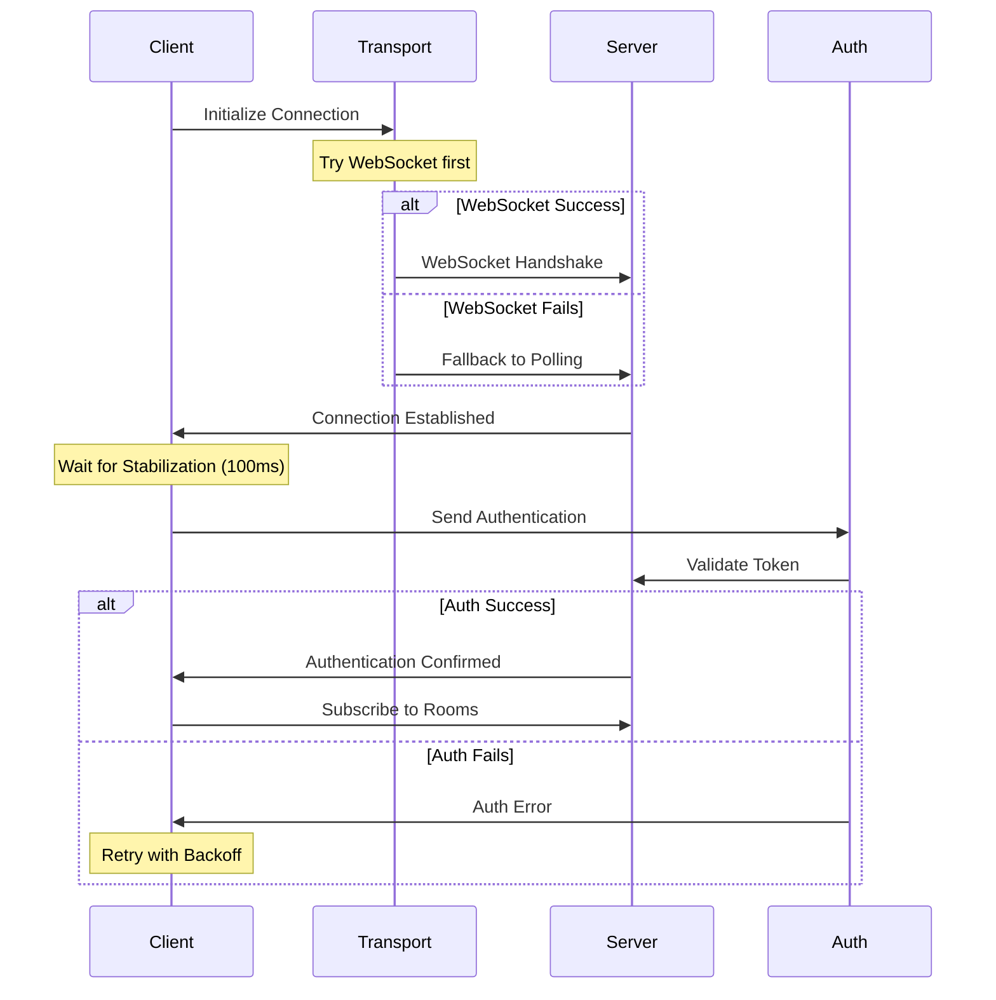

# Socket Connection System Documentation

## Overview

The chat application uses Socket.IO for real-time communication with enhanced reliability features including:
- Transport fallback (WebSocket → Polling)
- Smart reconnection strategy
- Authentication flow
- Error recovery

## Connection Flow



## Transport Layer

### WebSocket Transport
- Primary transport method
- Full-duplex communication
- Lower latency and overhead

### Polling Fallback
- Automatic fallback if WebSocket fails
- Compatible with restrictive networks
- Higher latency but reliable

## Authentication Process

1. Initial Connection
   - Socket connects with transport layer
   - Connection stabilizes for 100ms
   - Transport state verified

2. Authentication Flow
   - Send user credentials
   - Server validates token
   - Confirm authentication
   - Subscribe to rooms

3. Error Recovery
   - Up to 3 retry attempts
   - Smart backoff strategy
   - Transport fallback if needed

## Error Handling

### Connection Errors
```typescript
type ConnectionError = {
  type: 'transport' | 'auth' | 'network';
  retryable: boolean;
  backoffTime: number;
}
```

### Recovery Strategy
- Initial 300ms delay
- Incremental backoff (100ms per attempt)
- Maximum 2000ms delay
- Random jitter to prevent thundering herd

## Connection States

| State | Description | UI Feedback |
|-------|-------------|-------------|
| Offline | No network connectivity | Red indicator |
| Connecting | Initial connection attempt | Amber indicator |
| Authenticating | Sending credentials | Blue indicator |
| Connected | Fully authenticated | Green indicator |
| Reconnecting | Lost connection | Amber indicator |

## Debug Tools

The SocketDebugPanel provides real-time monitoring:
- Connection status
- Transport type
- Event history
- Message count
- Manual reconnect
- Test message functionality

## Best Practices

1. Connection Management
   ```javascript
   // Wait for connection stabilization
   await new Promise(resolve => setTimeout(resolve, 100));
   if (socket.connected) {
     // Proceed with authentication
   }
   ```

2. Error Handling
   ```javascript
   socket.on("connect_error", (error) => {
     if (error.type === "TransportError") {
       // Allow transport fallback
     } else {
       // Implement retry with backoff
     }
   });
   ```

3. Authentication
   ```javascript
   socket.on("authenticated", (response) => {
     if (response.success) {
       // Subscribe to rooms
     } else {
       // Retry authentication if attempts < 3
     }
   });
   ```

## Troubleshooting Guide

### Common Issues

1. Connection Failures
   - Check network connectivity
   - Verify WebSocket support
   - Check server status

2. Authentication Errors
   - Verify token validity
   - Check user permissions
   - Confirm server configuration

3. Reconnection Issues
   - Monitor backoff timing
   - Check transport fallback
   - Verify server availability

### Debugging Steps

1. Enable Debug Panel
   ```javascript
   localStorage.setItem('ENABLE_SOCKET_DEBUG', 'true');
   ```

2. Monitor Events
   - Check connection events
   - Verify transport type
   - Monitor authentication flow

3. Test Connection
   - Use force reconnect
   - Send test messages
   - Check server logs

## Configuration Reference

### Client Settings
```javascript
{
  transports: ["websocket", "polling"],
  reconnection: true,
  reconnectionDelay: 1000,
  reconnectionDelayMax: 5000,
  timeout: 45000
}
```

### Server Settings
```javascript
{
  transports: ["polling", "websocket"],
  pingTimeout: 30000,
  pingInterval: 10000,
  upgradeTimeout: 10000,
  allowUpgrades: true
}
```

## Event Reference

| Event | Description | Parameters |
|-------|-------------|------------|
| connect | Connection established | - |
| disconnect | Connection lost | reason: string |
| connect_error | Connection failed | error: Error |
| reconnect | Reconnection successful | attemptNumber: number |
| authenticated | Auth successful | response: AuthResponse |
| subscribed | Room subscription | response: SubscribeResponse |

## Performance Considerations

1. Transport Selection
   - WebSocket preferred for lower latency
   - Polling as reliable fallback
   - Automatic upgrade when possible

2. Reconnection Strategy
   - Smart backoff prevents server load
   - Jitter prevents connection floods
   - Maximum retry limit

3. Authentication Optimization
   - Connection stabilization delay
   - Efficient token validation
   - Room subscription batching
